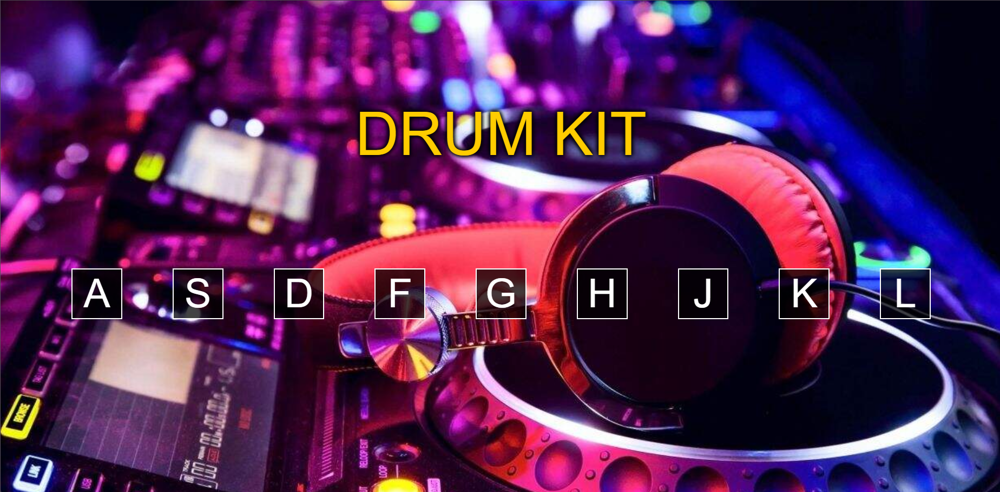

# 🥁 Drum Kit

Drum Kit interativo desenvolvido com **HTML, CSS e JavaScript**.

Cada tecla reproduz um som diferente de bateria, permitindo utilizar tanto o teclado do computador quanto os botões exibidos na tela.

---

## 📸 Preview

<p align="center">
  
</p>

---

## 💻 Sobre o projeto

Este mini projeto foi desenvolvido para praticar manipulação do DOM, eventos e reprodução de áudio através do JavaScript.

Os botões correspondentes às teclas são criados dinamicamente através do próprio JavaScript.

O projeto reconhece tanto cliques realizados com o mouse quanto comandos enviados pelo teclado.

---

## 🛠️ Tecnologias utilizadas

- HTML5
- CSS3
- JavaScript

---

## 🎵 Como funciona

As teclas disponíveis são:

`A` `S` `D` `F` `G` `H` `J` `K` `L`

Cada tecla reproduz um som diferente de bateria.

Também é possível clicar diretamente nos botões utilizando o mouse.

---

## ✨ Funcionalidades

- Reprodução de sons
- Controle através do teclado
- Controle através do mouse
- Criação dinâmica dos botões
- Efeito visual ao pressionar uma tecla

---

## 📚 O que pratiquei

- Objetos em JavaScript
- Funções
- `Object.keys`
- Manipulação do DOM
- `createElement`
- `appendChild`
- Eventos de teclado
- Eventos de clique
- Reprodução de áudio
- Manipulação de classes CSS
- `addEventListener`

---

## 📂 Estrutura principal

```text
mini-projeto-DrumKit/
├── img/
├── sounds/
├── index.html
├── index.js
└── style.css
